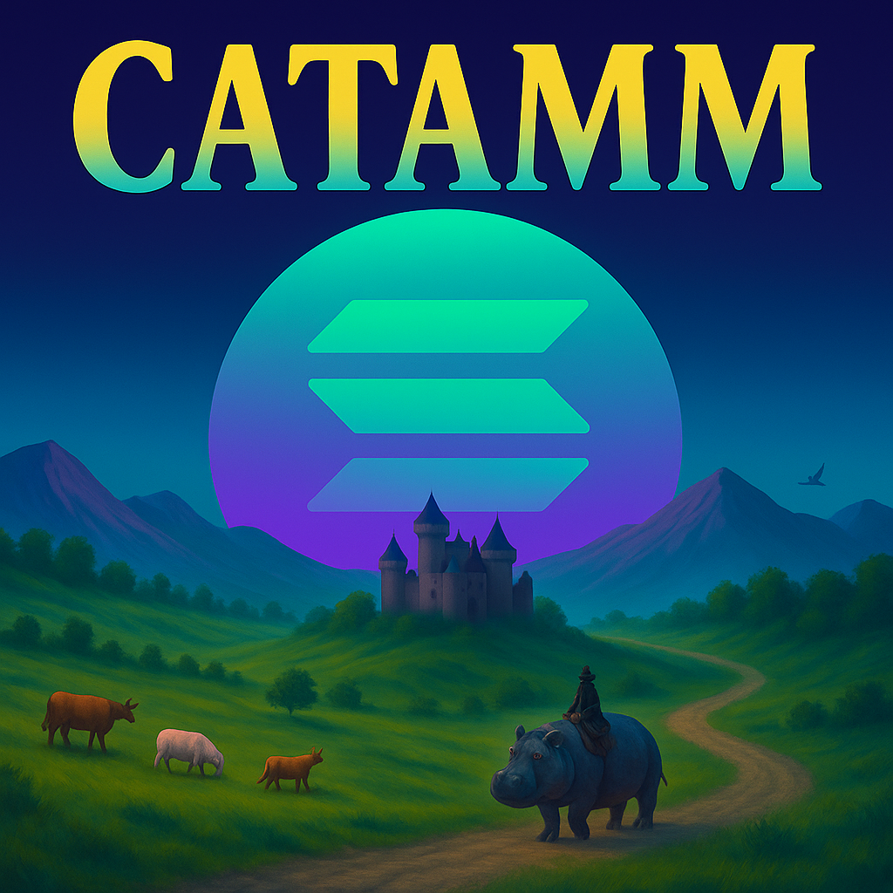

# CATAMM - Catan with Automated Market Makers

<div align="center">
  
  
  **A strategic board game combining Settlers of Catan with DeFi-style AMM trading**
</div>

## Overview

CATAMM reimagines resource trading in Settlers of Catan by replacing traditional player-to-player negotiations with Automated Market Maker (AMM) pools. Players can build and own ports that host dynamic markets, creating an ever-changing economic landscape where resource values fluctuate based on supply and demand.

## Key Features

- **Dynamic AMM Markets**: Resource prices fluctuate based on constant product formula (x × y = k)
- **Port Ownership**: Own a port for 0% trading fees vs 10% for others
- **Strategic Placement**: Ports are built on vertices between two different resource hexes
- **Pure Resource Economy**: Direct resource-to-resource swaps without currency tokens
- **Interactive UI**: Modern React/TypeScript interface with real-time market visualization

## Game Mechanics

### Resources
The game features the standard 5 Catan resources:
- Wood (Wo)
- Brick (B) 
- Sheep (S)
- Wheat (Wh)
- Ore (O)

### AMM Markets
- **10 possible markets**: One for each resource pair combination.
- **9 possible port locations**: Players build settlements/cities on portable vertices (a perimeter vertex that joins 2 adjacent hexes) to activate markets
- **Randomized available markets**: The trading pair is defined by the two resources of the port's two adjacent hexes, which randomizes which markets are available
- **Constant product formula**: `x × y = k` maintains market balance
- **Initial liquidity**: Markets start with small reserves that grow through player deposits

### Trading Mechanics
```
Output = (Reserve_out × Input) / (Reserve_in + Input)
```

**Trading Fees**:
- **Port owner**: 0% fee (free trading at your own port)
- **Other players**: 10% fee on all trades
- Fees are taken from input amount before swap calculation

### Building & Victory

**Standard Catan Costs**:
- Road: 1 Wood + 1 Brick
- Settlement: 1 Wood + 1 Brick + 1 Sheep + 1 Wheat
- City: 3 Ore + 2 Wheat
- Development Card: 1 Ore + 1 Sheep + 1 Wheat

**Victory Points** (First to 10 wins):
- Settlement: 1 VP
- City: 2 VP
- Longest Road: 2 VP
- Largest Army: 2 VP
- Victory Point Cards: 1 VP each

### Special Mechanics

**Portable Vertices**: 
- Located on board perimeter between two different resource hexes
- Building here creates an AMM market for those two resources
- Strategic locations that provide trading advantages

**Robber/Ghost Ship** (on roll of 7):
- Traditional robber: Block hex production and steal from a player

## Tech Stack

- **Frontend**: React 18, TypeScript 5
- **UI Framework**: Tailwind CSS, Radix UI components
- **Build Tools**: Vite, PostCSS
- **Board Rendering**: SVG-based hexagonal grid system
- **State Management**: React hooks and context
- **Testing**: Vitest
- **Code Quality**: ESLint, Prettier
- **Python Tools**: Game balance analysis scripts

## Installation

### Prerequisites
- Node.js 18+ and npm
- Python 3.x (for analysis tools)
- Git

### Setup
```bash
# Clone the repository
git clone https://github.com/yourusername/catamm.git
cd catamm

# Install dependencies
npm install

# Set up Python environment (optional, for analysis tools)
conda env create -f environment.yml
conda activate catamm
```

## Development

### Running the Application
```bash
# Start development server
npm run dev

# Type checking
npm run typecheck

# Linting
npm run lint

# Run tests
npm test

# Build for production
npm run build
```

### Project Structure
```
catamm/
├── src/
│   ├── components/     # React components
│   │   ├── amm/       # AMM trading interface
│   │   ├── board/     # Board visualization components
│   │   ├── game/      # Game controls and info
│   │   ├── layout/    # App layout components
│   │   └── player/    # Player status components
│   ├── models/        # Board setup and game models
│   ├── types/         # TypeScript type definitions
│   ├── utils/         # Utility functions
│   └── App.tsx        # Main application component
├── experiments/       # Prototypes and visualizations
├── reference/         # Reference implementations
│   ├── catanatron-ui/   # React/TypeScript Catan reference
│   └── settlers_of_catan_RL/ # Python game engine
├── scripts/          # Build and analysis scripts
└── tests/           # Test files
```

## Current Status

🚧 **Active Development** - Core game mechanics implemented, working on:

### Completed ✅
- Hexagonal board layout with proper coordinate system
- Port placement logic on portable vertices
- AMM trading interface with swap/deposit/withdraw
- Resource management system
- Modern UI with responsive panels
- SVG board rendering with interactive elements

### In Progress 🔄
- Game state management and turns
- Building placement validation
- Robber mechanics
- Multiplayer support
- Development card implementation
- Win condition checking

### Planned 📋
- Conversion to Solana program
- Solana wallet integration

## Contributing

This is an experimental project exploring the intersection of board games and DeFi mechanics. Contributions welcome for:
- Game balance improvements
- UI/UX enhancements
- Bug fixes and optimizations
- Documentation and tutorials
- New feature ideas

## References

- Inspired by Klaus Teuber's [Settlers of Catan](https://www.catan.com/)
- AMM concepts from Uniswap, Raydium, and other DeFi protocols

## License

This project is licensed under the MIT License - see below for details:

```
MIT License

Copyright (c) 2025 Michael Feng

Permission is hereby granted, free of charge, to any person obtaining a copy
of this software and associated documentation files (the "Software"), to deal
in the Software without restriction, including without limitation the rights
to use, copy, modify, merge, publish, distribute, sublicense, and/or sell
copies of the Software, and to permit persons to whom the Software is
furnished to do so, subject to the following conditions:

The above copyright notice and this permission notice shall be included in all
copies or substantial portions of the Software.

THE SOFTWARE IS PROVIDED "AS IS", WITHOUT WARRANTY OF ANY KIND, EXPRESS OR
IMPLIED, INCLUDING BUT NOT LIMITED TO THE WARRANTIES OF MERCHANTABILITY,
FITNESS FOR A PARTICULAR PURPOSE AND NONINFRINGEMENT. IN NO EVENT SHALL THE
AUTHORS OR COPYRIGHT HOLDERS BE LIABLE FOR ANY CLAIM, DAMAGES OR OTHER
LIABILITY, WHETHER IN AN ACTION OF CONTRACT, TORT OR OTHERWISE, ARISING FROM,
OUT OF OR IN CONNECTION WITH THE SOFTWARE OR THE USE OR OTHER DEALINGS IN THE
SOFTWARE.
```

## Acknowledgments

Thanks to the open-source community for reference implementations and the Catan community for inspiration. Special thanks to:
- The [Hummingbot](https://hummingbot.org/) community for testing this out!
- DeFi protocols like Uniswap and Raydium for pioneering AMM technology
- Klaus Teuber for creating the timeless Settlers of Catan